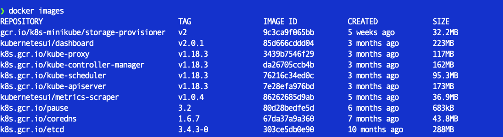

## Deploying a Hello Go app in Kubernetes

### 1. Creating a container for Go app

- we begin by creating a container for our GO app
- This is to ensure the app is able to run on a container before being deployed to a kubernetes cluster
- In order to do this we have to create a ``` Dockerfile```

```
ROM golang:1-alpine as build

WORKDIR /app

COPY cmd cmd

RUN go build cmd/hello/hello.go

FROM alpine:latest

WORKDIR /app

COPY --from=build /app/hello /app/hello

EXPOSE 8100

ENTRYPOINT ["./hello"]
```

- we create a multi-stage build as the app is only small and doesnt require much for it to operate

- To build the container from the `Dockerfile` we run the following command:

```
docker build -t hello-go
```
- To run the container and expose the internal port to your localhost, run the command:

```
docker run --name hello-g0 --rm -p 8180:8180 hello-go
```

## Deploying Hello-go app in Kubernetes

- This example will show how to run a single container into kubernetes, using a small local kubernetes environment - MiniKube

- If you're on mac, you can download minikube with the following command:

```
 brew install minikube
```

- If you're on windows, you can install minikube with chocolatey:

```
choco install MiniKube
```

### Starting Minikube

- Starting minikube is simple:

```
 minikube start
```

### Building the hello-go container in Minikube

- Because minikube is essential a seperate VM on your local machine, it does not have access to your Docker registry and therefore if you attempt to pull the image inside the minikube kubernetes cluster, you will face an error

- to overcome this error, it is recommended that images are built inside the minikube environment and to do this we need to set our local docker CLI to use minikube's docker daemon:

```
eval $(minikube docker-env)
```


- if your run ``` docker images``` now you will docker images that are found in the minikube environment



